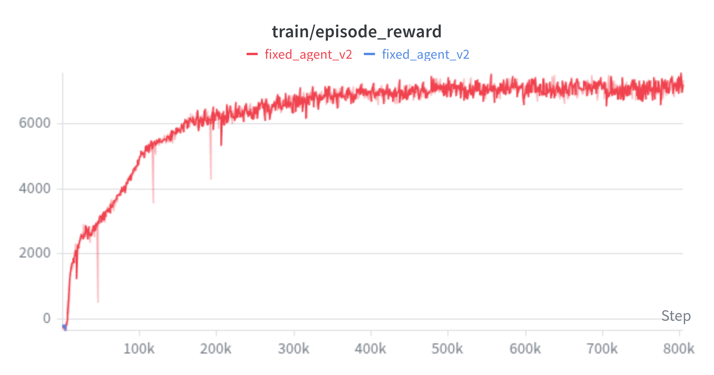
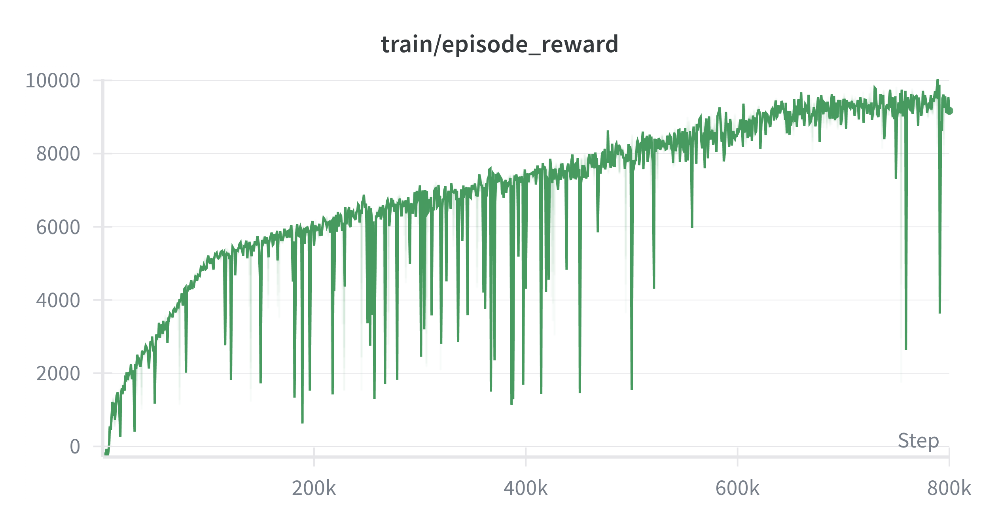

# TD-MPC Reproduction

This repository contains a clean, minimalist implementation of **TD-MPC** (Temporal Difference Learning for Model Predictive Control) by Hansen et al. (ICML 2022), written from scratch in PyTorch. The project reproduces the original results on the HalfCheetah-v5 environment and includes an ablation study on the latent consistency loss.

## Results

### HalfCheetah-v5
The agent reaches an episode reward of over 7000 by around 400k environment steps and maintains stable performance around that value for the remainder of the training (up to 800k steps), indicating successful convergence. Further training does not lead to significant improvement, confirming that the policy has converged. The learning curve is shown below:



### Ablation: Consistency Loss
Disabling latent consistency loss led to significantly better performance (over 9500 reward), at the cost of stability, suggesting that this regularization may not be necessary in state-based tasks.



## Usage
To train the agent: 
```bash
python train.py
```
To run an ablation test: 
```bash
python train_ablation.py
```

## Project Structure
- `agent.py` – TD-MPC agent with MPPI planner and update logic
- `model.py` – TOLD neural network architecture (encoder, dynamics, reward, Q-networks, policy)
- `buffer.py` – replay buffer for storing and sampling experience
- `config.py` – hyperparameters and configuration
- `train.py` – main training loop
- `train_ablation.py` – main training loop for ablation test
- `utils.py` – helper functions (EMA, linear schedule)
- `figures/` – result plots (training curve, ablation study)
- `paper/` – final PDF of the project report
- `videos/` – demonstration video of the trained agent on HalfCheetah-v5

## References
- Hansen, N., Wang, X., & Su, H. (2022). Temporal Difference Learning for Model Predictive Control. *International Conference on Machine Learning (ICML)*.
- Original codebase: [https://github.com/nicklashansen/tdmpc](https://github.com/nicklashansen/tdmpc)

## Requirements

- Python 3.8+
- PyTorch 1.12+
- gymnasium
- MuJoCo (install via `pip install mujoco`)
- wandb (optional, for logging)

### Trained HalfCheetah agent
[Watch the trained agent in action](videos/halfcheetah-trained.mp4)

Install dependencies:
```bash
pip install -r requirements.txt

